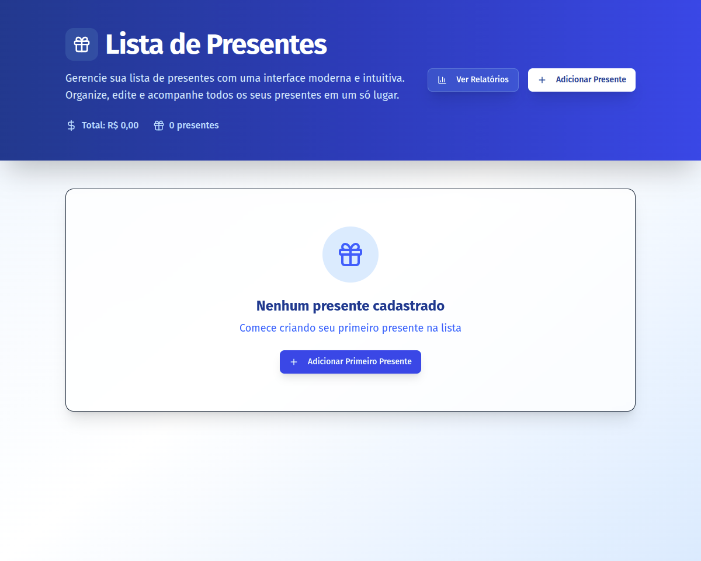

---

## 📸 Captura de Tela



---

# 🎁 GiftWise – Frontend

Interface web para o projeto **GiftWise**, uma aplicação moderna e intuitiva para gerenciamento de presentes. Este frontend foi desenvolvido com **Next.js** e **Tailwind CSS**, e se comunica com a API REST do backend.


---

## 🚀 Tecnologias e Ferramentas

* **Next.js** – Framework React para SSR e SPA híbrido.
* **React 19**
* **Tailwind CSS 4** – Estilização utilitária e responsiva.
* **Radix UI** – Acessibilidade e componentes de UI headless.
* **Lucide Icons** – Ícones SVG modernos e leves.
* **Luxon** – Manipulação e formatação de datas.
* **Sonner** – Toasts de notificação rápidos e personalizáveis.
* **Dark Mode** – via `next-themes`.
* **Animações** – com `tw-animate-css`.

---

## 📦 Instalação e Execução

### 1. Clone o repositório

```bash
git clone https://github.com/kelwinv/desafio-pixelhouse
cd web
```

### 2. Instale as dependências

```bash
npm install
```

### 3. Configure as variáveis de ambiente

Crie um arquivo `.env` na raiz do projeto com o seguinte conteúdo:

```
API_URL=http://localhost:3333
```

> 🔁 Essa variável define a URL da API backend que será consumida pelo frontend.

### 4. Execute o projeto

```bash
npm run dev
```

Acesse o frontend em: [http://localhost:3000](http://localhost:3000)

---

## 🧪 Scripts disponíveis

| Script  | Descrição                                         |
| ------- | ------------------------------------------------- |
| `dev`   | Inicia o servidor Next.js em modo desenvolvimento |
| `build` | Compila a aplicação para produção                 |
| `start` | Inicia o servidor Next.js com build pronto        |
| `lint`  | Executa linting de código                         |

---

## 🧰 Estrutura do Projeto

```bash
.
├── app/                # Rotas e páginas (Next 15 – App Router)
├── components/         # Componentes reutilizáveis (UI, ícones, etc)
├── lib/                # Utils (e.g., chamadas à API)
├── styles/             # Tailwind, animações, variáveis globais
├── public/             # Imagens públicas
├── .env.local          # Configuração da API
├── tailwind.config.ts  # Configuração Tailwind
└── next.config.js      # Configurações do Next.js
```

---

## 💡 Observações

* O projeto foi iniciado com o **App Router (Next.js 15)**.
* A responsividade e acessibilidade foram priorizadas desde o início.
* A comunicação com a API é feita usando **fetch** ou bibliotecas auxiliares em `lib/api.ts`.
* O botão "Adicionar Presente" abre um modal com formulário para cadastro rápido.

---

## ✅ Pré-requisitos

* Node.js 18 ou superior
* API Backend em execução (ver [`giftwise-api`](https://github.com/seu-user/giftwise-api))

## 📬 Sugestões e Contribuições

Contribuições são bem-vindas! Crie uma issue ou abra um PR 😄

---